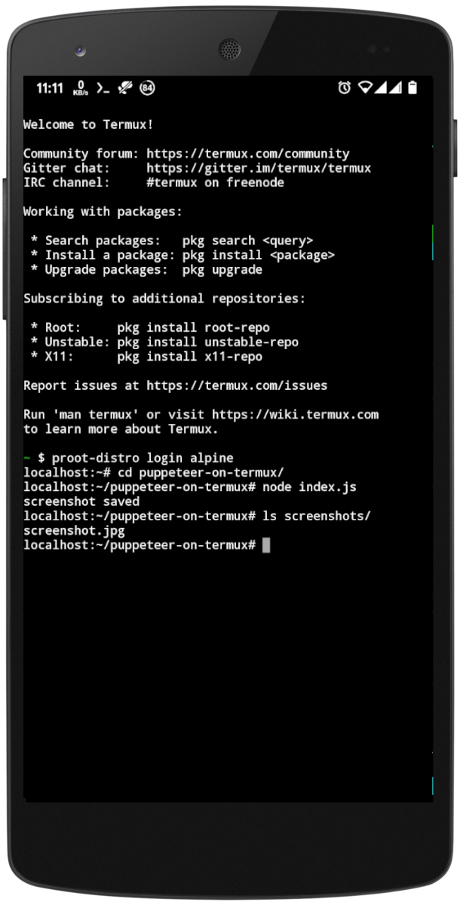

# Puppeteer on termux

Run Puppeteer on [Termux](https://termux.com/)

### What is Termux?
Termux is an Android terminal emulator and Linux environment app that works directly with no rooting or setup required. A minimal base system is installed automatically - additional packages are available using the APT package manager.



**Assumptions**
* You have termux installed and have sufficient permissions
* You have logged-in as root user
* You are okay with running Puppeteer inside a container (Alpine)

**Gotchas**
* There is no build of Google Chrome available for ARM at this moment, so using chromium instead.
* Installing chromium on Termux directly requires snap which is another big hurdle so alternatively using alpine distro here.

### Install Prerequisites
```
pkg install proot-distro
proot-distro install alpine
proot-distro login alpine
apk update && apk add --no-cache nmap && \
  echo @edge http://nl.alpinelinux.org/alpine/edge/community >> /etc/apk/repositories && \
  echo @edge http://nl.alpinelinux.org/alpine/edge/main >> /etc/apk/repositories && \
  apk update && \
  apk add --no-cache \
  chromium
```
* Node js v12.14+
* Yarn v1.22+

### Usage
```
git clone https://github.com/rishabhrpg/puppeteer-on-termux.git
cd puppeteer-on-termux
yarn install
node index.js
```

* If you see a message "screenshot saved" then puppeteer is successfully configured to run on termux
* Use this repo as starting point as it has correct args included to successfully run chromium on termux
* To view screenshot on your device you can run `npx http-server` and aceess the screenshot directory from a browser.

## References
* [Puppeteer running as root without --no-sandbox is not supported](https://www.xspdf.com/resolution/50662388.html)
* [Set up Headless Chrome Node.js server in Docker](https://blog.logrocket.com/how-to-set-up-a-headless-chrome-node-js-server-in-docker/)
* [Enjoyable browser automation with Puppeteer](https://www.lambrospetrou.com/articles/enjoyable-browser-automation-puppeteer-playwright/)
* [Set Chrome Flags in Puppeteer](https://stackoverflow.com/questions/50607866/setting-specific-chrome-flags-in-puppeteer-enable-and-disable)

### License
MIT
